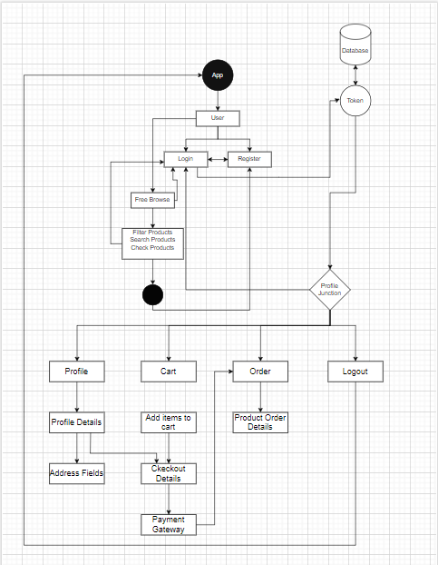

# MunchEase is a fullstack food ordering web application. 

## Application Flow Diagram


## Setting Up MunchEase

Below are the instructions to setup MunchEase locally.

## Prerequisites
Node.js and NPM must be installed on the system.


## Cloning the Repository

```bash
git clone https://github.com/Hemangshu-Dey/MunchEase.git  
```
```bash
cd MunchEase
```


## Configurations
### Environment File(backend directory):
Navigate to the backend folder and create `.env` file. Add the following content to the file:  

```bash
MONGODB_URI=   
JWT_SECRET=  
PORT= 
```

* Create account at MongoDB and create a cluster to get the secret connection string. Copy the secret connection string and paste it in the `MONGODB_URI`.  
* `JWT_SECRET` can be any random string.  
* `PORT` can be any port as per your wish(For example 3000).

### Environment File(frontend directory):
Navigate to the frontend folder and create `.env` file. 
Add the following content to the file: 

```bash
VITE_BACKEND_URL=http://localhost:   
```

After http://localhost: add the port number which you gave in the backend environment variable(`For example http://localhost:3000`).

### Environment File(populateDB directory): 
Navigate to the populateDB folder and create `.env` file. Add the following content to the file: 
```bash
MONGODB_URI=  
```

Paste the same mongodb secret connection string in `MONGODB_URI`

## Running the Application
### For populateDB
To add dummy products in the database
* Navigate to the populateDB directory.
* Install dependencies: `npm install`.
* Start the application: `node index.js`.

### For backend
* Navigate to the backend directory.
* Install dependencies: `npm install`.
* Start the application: `npm run dev`.
### For frontend
* Navigate to the frontend directory.
* Install dependencies: `npm install`.
* Start the application: `npm run dev`.

Note: The backend and frontend should run simultaneously in two separate terminals


